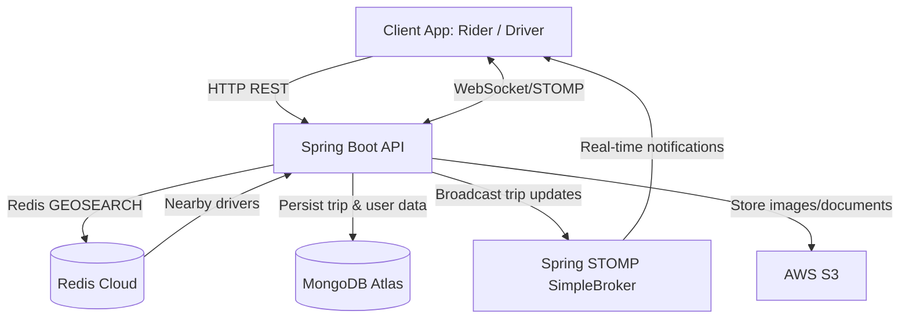

# AuraDrive: Real-Time Ride-Hailing Backend

A production-ready, cloud-native ride-hailing backend architecture engineered using **Java 17** and **Spring Boot 3.x**. 
The system is built to orchestrate low-latency driver matching and reliable real-time trip lifecycles by exploiting polyglot persistence and event-driven architectures.

---
## 🏗 System Architecture Diagram


# 🏗 System Architecture

AuraDrive separates **real-time, latency-sensitive operations** from **persistent data storage** to deliver fast driver matching and reliable trip management.

### Spring Boot Application (API & Business Logic)

- Serves as the central entry point for all HTTP and WebSocket requests.
- Manages the complete trip lifecycle using a state machine:
  - `REQUESTED → BOOKED → STARTED → ENDED`
- Prevents invalid state transitions through business rules.
- Secures APIs using **JWT authentication** and **Role-Based Access Control (RBAC)** for Riders, Drivers, and Admins.
- Coordinates communication between Redis, MongoDB, WebSocket clients, and AWS S3.

---

### Redis (Real-Time & Geospatial Engine)

Redis handles high-frequency operations that require extremely low latency.

- Stores active driver locations using Redis Geospatial indexes.
- Performs fast nearby-driver searches using `GEOSEARCH`.
- Caches ride verification OTPs with a **5-minute TTL**.
- Offloads transient data from MongoDB to reduce database load and improve response times.

---

### WebSocket + STOMP (Real-Time Communication)

Instead of relying on client-side polling, AuraDrive uses WebSockets to deliver real-time updates.

Examples include:

- Driver accepted ride
- Driver location updates
- Ride status changes
- OTP generation and verification
- Trip completion notifications

This event-driven approach minimizes unnecessary API requests while providing an instant user experience.

---

### MongoDB Atlas (Persistent Storage)

MongoDB stores long-term application data, including:

- User profiles
- Driver information
- Trip history

Its flexible document model allows the schema to evolve as new features are introduced.

---

# 🚀 Tech Stack

| Category | Technology |
|----------|------------|
| Language | Java 17 |
| Framework | Spring Boot 3.x |
| Security | Spring Security, JWT, BCrypt |
| Database | MongoDB Atlas |
| Cache & Geospatial | Redis Cloud |
| Real-Time Communication | WebSocket + STOMP |
| Object Storage | AWS S3 |
| Deployment | Render |
| Containerization | Docker |

---

# 🔑 Engineering Decisions

### Polyglot Persistence

AuraDrive leverages **MongoDB** and **Redis** for different workloads.

- **MongoDB** stores persistent business data such as users and trips.
- **Redis** handles high-frequency geospatial lookups and temporary data.

Using Redis for driver discovery avoids expensive location queries against MongoDB and keeps response times consistently low.

---

### Event-Driven Communication

Instead of repeatedly polling REST endpoints, clients maintain a WebSocket connection.

The server pushes updates only when state changes, reducing:

- API requests
- Network overhead
- Mobile battery consumption
- Perceived latency

---

### Decoupled Object Storage

Driver verification documents and profile images are stored in **AWS S3** instead of MongoDB.

Benefits include:

- Smaller database size
- Faster database queries
- Simplified backups
- Better scalability for media files

---

### Stateless Authentication

Authentication is implemented using **JWT access tokens**.

Because the server maintains no session state:

- Horizontal scaling is straightforward.
- Load balancers do not require sticky sessions.
- Any application instance can process authenticated requests.

---

# ⚙️ Local Development

## Prerequisites

- Java 17
- Apache Maven
- Docker & Docker Compose
- Git

---

## Environment Variables

Create a `.env` file in the project root.

```env
# MongoDB
MONGODB_URI=mongodb+srv://<username>:<password>@cluster.mongodb.net/auradrive

# Redis
REDIS_HOST=<redis-host>
REDIS_PORT=6379
REDIS_PASSWORD=<redis-password>

# JWT Security
JWT_SECRET=<your-256-bit-secret>

# AWS S3
AWS_REGION=ap-south-1
AWS_ACCESS_KEY=<access-key>
AWS_SECRET_KEY=<secret-key>
AWS_S3_BUCKET=<bucket-name>
```

> **Note:** Never commit your `.env` file to version control. Ensure it is included in your `.gitignore`.

---

## Running the Application

Clone the repository:

```bash
git clone https://github.com/<your-username>/AuraDrive.git
cd AuraDrive
```

Build the project:

```bash
mvn clean install
```

Run the application:

```bash
mvn spring-boot:run
```

Or start the complete local environment using Docker Compose:

```bash
docker compose up --build
```

---

#  Highlights

-  Real-time ride lifecycle management using WebSockets
-  Redis-powered geospatial driver matching
-  JWT authentication with Role-Based Access Control
-  AWS S3 integration for media storage
-  Dockerized local development environment
-  Polyglot persistence with MongoDB and Redis
-  Low-latency architecture optimized for real-time workloads
